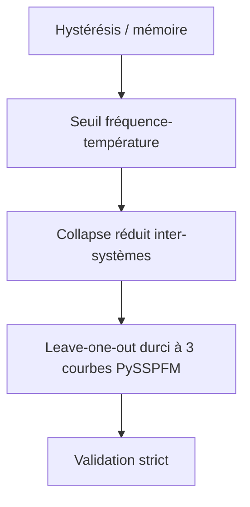

# Chaîne de validation du dossier électron

Date: 2026-05-07

## Résumé court

- Hystérésis: test déjà validé sur les boucles réelles.
- Seuil fréquence-température: test dédié validé strictement sur TempDep.
- Collapse inter-systèmes: leave-one-out durci à trois courbes PySSPFM, verdict strict.

## Chiffres clés

- Leave-one-out durci: mean held-out RMSE 0.442071, mean control RMSE 0.995418.
- Seuil fréquence-température: 20 points, fréquence span 0.826000, slope -0.003746095, LOO RMSE ratio 0.021865.
- Lecture opérationnelle: on ne voit pas seulement un fit local; on voit une chaîne de tests qui reste robuste quand on monte en sévérité.
